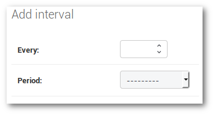

# Pinger

This an python application which sends ping commands to PCs to check whether if they are turned on.

<!-- TOC depthFrom:2 depthTo:6 withLinks:1 updateOnSave:1 orderedList:0 -->

- [About](#about)
- [Installation](#installation)
	- [Production (using docker)](#production-using-docker)
	- [Development (virtualenv)](#development-virtualenv)
- [Usage](#usage)
	- [Fist Run](#fist-run)
	- [Add pools and computers](#add-pools-and-computers)
	- [Schedule pinger runs](#schedule-pinger-runs)
	- [Export data](#export-data)
	- [Backups and restore](#backups-and-restore)
		- [Backup using django](#backup-using-django)
- [Requirements](#requirements)
- [Startup](#startup)
- [Architecture](#architecture)
- [Important files](#important-files)

<!-- /TOC -->

## About
This application was initially developed for psychology students to monitor changes in shutdown behavior (in contrast to merely logout) when students are pointed towards doing so with different wording.

To achieve this the online/offline state of PCs is monitored using ping commands.
Results are saved separated by pools and can be viewed using a web app or be exported as .csv files.
Based on these it can be evaluated if the behavior changes after placing hints asking to turn off the PC.

## Installation

### Production (using docker)
To get the application running, a docker compose file is provided. To get the application up:

```bash
git clone https://github.com/dobli/pinger
cd pinger
docker-compose up 	# may require sudo permissions / being member of docker group
```

This will download and setup all needed docker images and start them right away.
This starts the application in the foreground, this is useful for debugging.

To run the application in the background you may want to start it with the `-d` option:

```bash
docker-compose up -d
```

The docker-compose file only shows how a possible setup may look like and may be changed to your own need (e.g. change database credentials).

To be able to really use the application it first needs data (e.g. pools, PCs to track), see the [Usage](#usage) section below.

### Development (virtualenv)
For development purposes a webserver is not needed. To make development easy, a paython virtualenv should be used. To make handling of the virtualenv easier [virtualenvwrapper](https://virtualenvwrapper.readthedocs.io/en/latest/) can be used.

Within the activated virtualenv execute the following commands:

```bash
git clone https://github.com/dobli/pinger
cd pinger
pip install -r requirements.txt
circusd circus-pinger-dev.ini
```

This gets the pinger sources, installs the requirements into your virtualenv and then starts the django and celery instances.

The app needs a message broker to be able to executes the tasks, RabbitMQ is recommended, other AMQP brokers are possible too, the default development setup expects an user called *guest* with password *guest* to exist on the message broker (e.g. *rabbitmqctl add_user guest guest*) usally this user exists by default.

The web service is then reachable at:

http://localhost:8000/pingerweb/pools/

## Usage

### Fist Run
When first starting the application it does not know yet which pools it has to track.
To be able add these the administration UI can be used. It is available at `<serveradress>/admin`, when running locally this would be `localhost/admin`.

To access this page you need an administration account, the default account useses `pingeradmin` as username and `pingerpass` as password.
**Attention**: Please change the password using the change password menu in the top right after first login.

The administration UI looks like this:


Here you can find two important section:

1. Manage data used by pinger like pools and computers
2. Manage intervals in which you want to run pings (recommended 5 mins, see below for an example)

### Add pools and computers

When clicking on the Pool entry in the admin UI you get an overview of already created pools. Here you can click on 'Add Pool' in the top right to create a new one.
You get a masks which asks for the room no of the pool, as well as some metadata which could be used like if a printer is available.


At the bottom of the from you have the option to immediately add computers to the pool during creation. If the room has a defined IP range it is recommeded to use the fields "Start IP" and "End IP", these will create an computer entry for all PCs in that range. For entering single PCs the lower section allow to add them individually.

Pools/Computers can also be backed up using the Export/Import buttons in their respective overview.

### Schedule pinger runs

By default the pinger runs are not executed right away, they first need to be scheduled. For this you have to take a look at the second section of the admin menu mentioned above.
In this you can define periodic tasks and intervals to execute them.

First you would need to create an interval. For this click on 'Intervals' and then on 'Add Interval' in the upper right corner.
On the next page you can setup the period of the interval (e.g. every 5 minutes).



After creating the interval go back to the Home page of the admin interface and then choose 'Periodic tasks' and click on 'Add Periodic Task'.
With this form you can choose which task to execute in intervals, in our case the only interesting one is `pingerservice.tasks.start_pinger_run` choose it and add a name as description.
In the lower section choose the Interval which we created earlier (e.g. 'every 5 minutes'). That is all click on save and the run will now start every 5 minutes.


To halt the pinger runs edit the task and uncheck the "Enabled" box and save the changes.

### Export data
To export .csv data from pinger to be used for further analysis you can use the corresponding UI tab. Choose the pools you are interested in and select the date at the bottom. Then click on *Export* after a few seconds the Download should start. Selecting no room equals to getting all rooms.

The data consists of one row of data for each day and 5 columns for each pool. The data describes for each day and pool the sum of the runtime in each pool, the real average runtime (not dependent on number of PCs in a pool, only taking into account PCs which were used) and the calculated energy consumption depending on the consumption settings of that pool as well as the total number of PCs. 

### Backups and restore
To back up the data pinger collects there are multiple options.
If only the information about pools and PCs is needed the method using the UI is recommended, this only saves and loads the pools to monitor.

To create full updates the usage of command line commands are recommended (may be placed in a cron tab to execute them scheduled).
Here again multiple options exist.

#### Backup using django
Django allows to backup and restore data using fixture file (see [here](https://docs.djangoproject.com/en/2.0/howto/initial-data/)).
To dump all data of the `pingerservice` (in human readable format using indentation), run:
```shell
python manage.py dumpdata --indent 2 pingerservice > pingerdump.json
```
When running it inside a docker container (defaultname `pingerapp`) it needs to be executed inside the contianer.

```shell
docker exec -t pingerapp python manage.py dumpdata --indent 2 pingerservice > pingerdump.json
```

In both cases the file `pingerdump.json` gets stored in the current working direcotry.

## Requirements
The pinger implementations needs a few depndencies to run:

 - RabbitMQ - a message broker an queue (just install from repo)
 - ngnix - webserver to display static content
 - python3 (additional requirements are in requirements.txt)

For production usage all requirements are covered by docker containers so only docker and docker-compose are needed on the target machine.

## Startup
To be able to use the Application 3 Services need to run:

 - django for the WebInterface
 - celery to manage workers which ping computers
 - celery-beat which schedules celery tasks (e.g. ping every 5 minutes)

These can be started during development with these commands:

 - django: python manage.py runserver
 - celery: celery -A pinger worker [-l info]
 - celery-beat: celery -A pinger beat -S django [-l info]

The option -l is optional and displays additional information for each celery task. Option -A defines the app to use (pinger in our case), -S sets celery-beat to use the django Database to manage its shedule (makes it accessible from the Django interface)

## Architecture

The new pinger python implementation uses several components. The core consists of several Python modules. In addition it needs an external message broker (e.g. RabbitMQ) and for production deployment a web server is expected.

To make deployment easy, a docker-compose setup is available (see image above). This setup uses a NGINX web server container and a RabbitMQ message broker container. In addition a third container is used, it contains the pinger application with all its Python dependencies.

The core of the setup uses the *Django* framework. The project consists of two Django apps. The first, called **pingerservice**, defines the Pinger data model, contains the ping logic (see below) and provides an API to access the data via GET requests.

The second Django app, called **pingerweb** provides the HTML GUI for the pinger application. It mainly consists of several HTML5 pages (glued together by Django). For data access it relies on AJAX/JavaScript calls on client side, using the mentioned API of the **pingerservice**. As special API needs can be addressed directly (e.g. producing chart data), the client side JS code can be reduced.

In addition to Django the Celery framework is used. *Celery* and its extention *Celery Beat* allow to define, schedule and queue tasks. It incorporates a worker concept, so several workers can be created which process predefined tasks in parallel. Celery integreates well into the Django framework, it uses the Django database to keep track of task schedules and the tasks can access the data model and create/modify data. Celery was used to define the pinging background tasks inside the **pingerservice** app. Celery Beat is used to schedule a ping to each PC every 5 minutes (this can be adjusted in the admin mask). When a ping run needs to be executed, Celery puts all Tasks into a RabbitMQ queue, then the celery workers process them.

Complementing the base Django/Celery app two other python modules are used, *Chaussette* and *Circus*. Chaussette is a wsgi server written in python it is used to startup our Django project and handels web server requests. Circus is a process manager and supervisor, it defines the startup of Chaussette (and therefore the Django project) as well as Celery and Celery Beat.

## Important files

To make ongoing development easier, a few important files are listed here  together with a short description of what they contain.

```bash
- pinger 			# Project specific files
	- settings.py		# General settings for the project
	- settings_prod.py	# production specific settings
	- settings_dev.py	# development specific settings
	- urls.py			# url patterns for whole project
- pingerservice 	# service app specific files
	- admin.py			# configure admin pages
	- models.py			# data models of pinger
	- tasks.py			# background tasks (e.g. ping)
	- urls.py			# url patterns for service app
	- views.py			# define HTTP/API endpoints
- pingerweb			# web app specific files
	- urls.py			# url patterns for web app
	- views.py			# define HTTP/HTML endpoints
	- static			# static files (.js, .css, images)
	- templates			# html templates used by views
```
